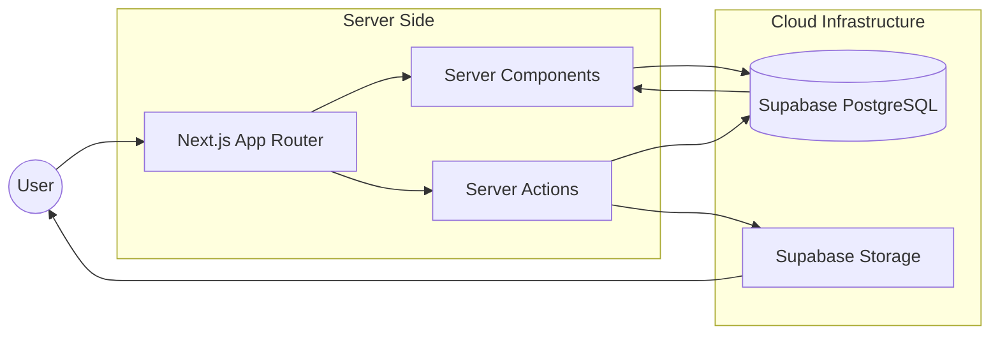

<div align="center">

# NextLevel Food

**A modern food-sharing platform built with Next.js, React, and Supabase.**

[](https://nextjs.org/)
[](https://react.dev/)
[](https://supabase.com/)
[](LICENSE)

[Report Bug](https://github.com/Mllkmoha/nextlevel-food/issues) &nbsp; | &nbsp; [Request Feature](https://github.com/Mllkmoha/nextlevel-food/issues)

</div>

---

## Project Preview

<div align="center">
  <p><i>Project screenshots coming soon.</i></p>
</div>

---

## Overview

**NextLevel Food** is a digital culinary hub where food enthusiasts can discover community-shared recipes and contribute their own. The platform focuses on a clean, editorial aesthetic and efficient data handling using the Next.js App Router and Supabase cloud infrastructure.

### Key Highlights
- **Modern Design System**: A polished visual identity utilizing Playfair Display and Inter typography.
- **Next.js App Router**: Leveraging Server Components for efficient rendering and reduced client-side JavaScript.
- **Cloud Integration**: Managed image hosting and data persistence via Supabase.
- **Responsive UI**: A fluid, accessible interface optimized for all device sizes.

---

## Features

| Feature | Description |
| :--- | :--- |
| 🍴 **Meal Discovery** | Browse community-shared meals through a responsive gallery. |
| 📖 **Recipe Details** | Explore detailed recipes with structured cooking instructions. |
| 📝 **Share Recipes** | Submit new meals with title, summary, instructions, and images. |
| 🖼️ **Cloud Storage** | Store uploaded meal images using Supabase Storage. |
| 🌐 **Community** | Learn more about the food-sharing community and its values. |

---

## Tech Stack

### Frameworks & Libraries
- **Framework**: [Next.js 16](https://nextjs.org/) (App Router)
- **Library**: [React 19](https://react.dev/)
- **Language**: JavaScript (ES6+)

### Infrastructure
- **Database**: [Supabase PostgreSQL](https://supabase.com/)
- **Storage**: [Supabase Storage](https://supabase.com/storage)
- **Server Actions**: Implemented for secure, server-side data mutations.

### Styling & UX
- **Styling**: CSS Modules & CSS Custom Properties
- **Typography**: Playfair Display (Serif) & Inter (Sans-serif)
- **Assets**: Custom SVG and PNG icon library

---

## Architecture

The application utilizes a server-centric architecture to optimize performance and SEO.



---

## Project Map

### Routes
| Route | Purpose |
| :--- | :--- |
| `/` | Landing page and hero section. |
| `/meals` | Community meals gallery. |
| `/meals/[MealSlug]` | Detailed recipe and instructions. |
| `/meals/share` | Recipe contribution form. |
| `/community` | Community information page. |

### Folder Structure
```text
├── app/                # Next.js App Router (Pages & Layouts)
│   ├── community/      # Community Hub
│   ├── meals/          # Meals logic (Listing, Detail, Share)
│   └── globals.css     # Design System (CSS Variables)
├── components/         # UI Components
│   ├── main-header/    # Navigation & Branding
│   ├── images/         # Slideshows & Image Handlers
│   └── meals/          # Meal Cards & Grid Systems
├── lib/                # Core Logic & Data Access
│   ├── actions.jsx     # Server Actions (Mutations)
│   ├── meals.jsx       # Data Access Layer (Queries)
│   └── supabase.js     # Supabase Client Initialization
└── assets/             # Static Brand Assets & Icons
```

---

## Installation & Setup

### Prerequisites
- Node.js 18.x or later
- A Supabase account

### Quick Start
```bash
# Clone the repository
git clone https://github.com/Mllkmoha/nextlevel-food.git

# Navigate to the project directory
cd nextlevel-food

# Install dependencies
npm install

# Start the development server
npm run dev
```

### Environment Configuration
Create a `.env.local` file in the root directory:

```env
NEXT_PUBLIC_SUPABASE_URL=
NEXT_PUBLIC_SUPABASE_PUBLISHABLE_KEY=
```

---

## Deployment

The project is optimized for deployment on **Vercel**.

1. Push your code to GitHub.
2. Import the repository into the [Vercel Dashboard](https://vercel.com).
3. Configure the required environment variables in the Vercel project settings.
4. Deploy.

---

## Author

**Mohamed Rafik Mellouk**
*Junior Full-Stack Web Developer*

[](https://github.com/Mllkmoha)

---

<div align="center">
  <sub>© 2026 Mohamed Rafik Mellouk · NextLevel Food</sub>
</div>
